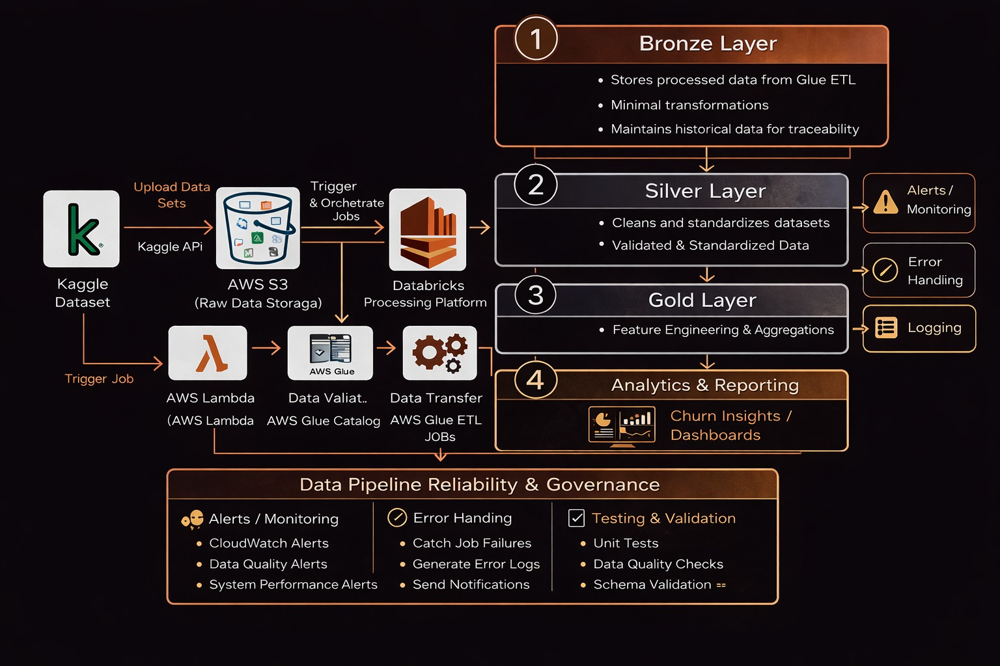
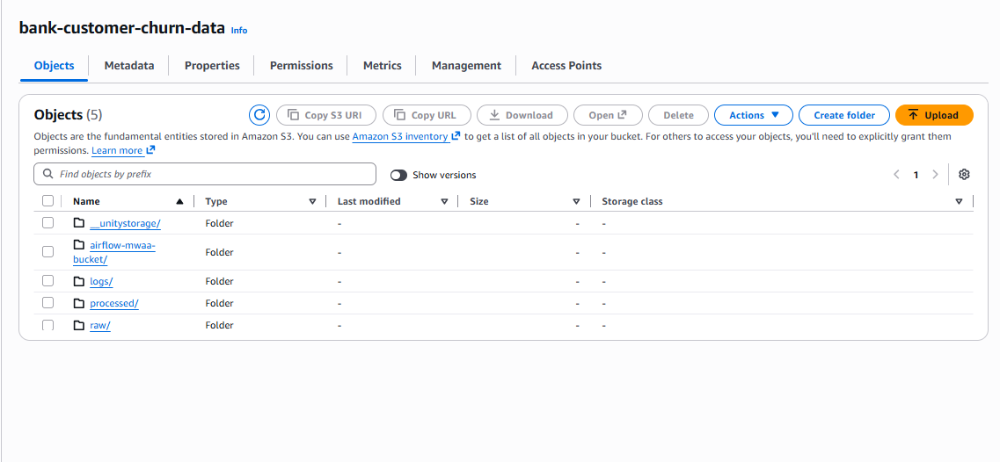
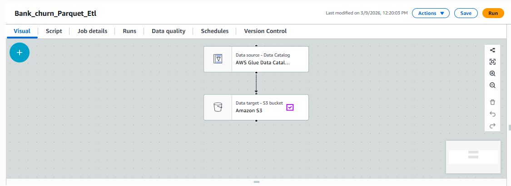
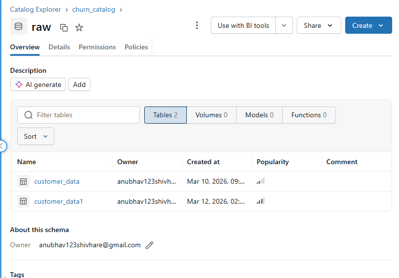
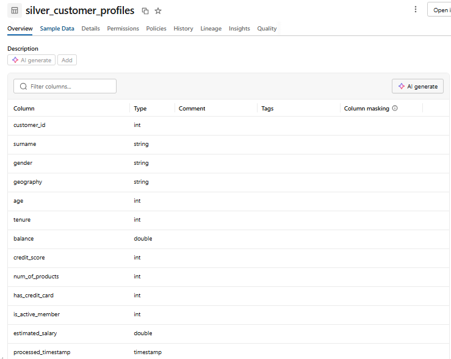
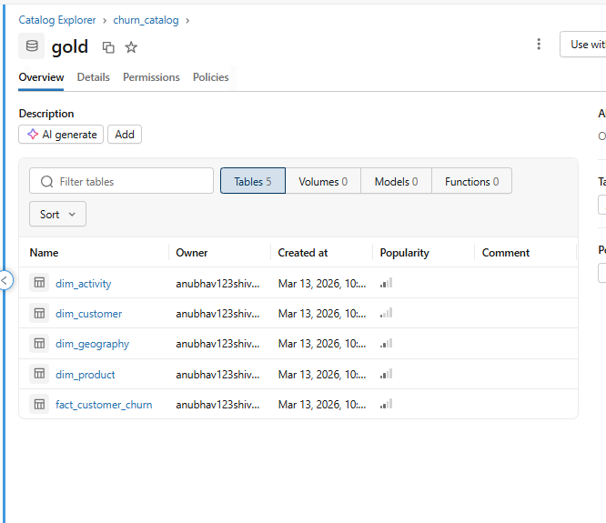
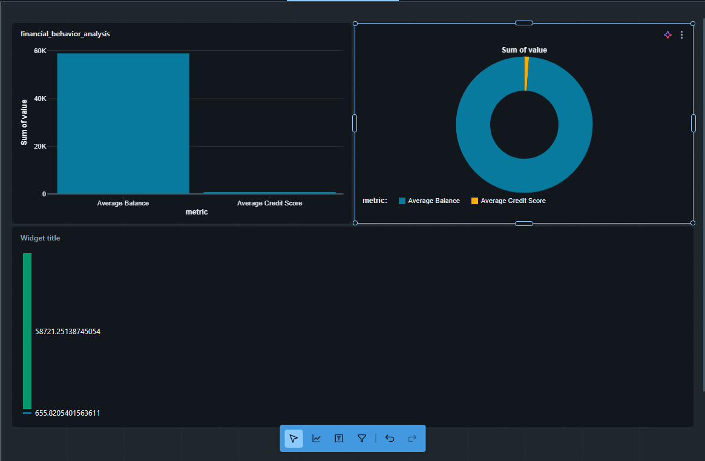
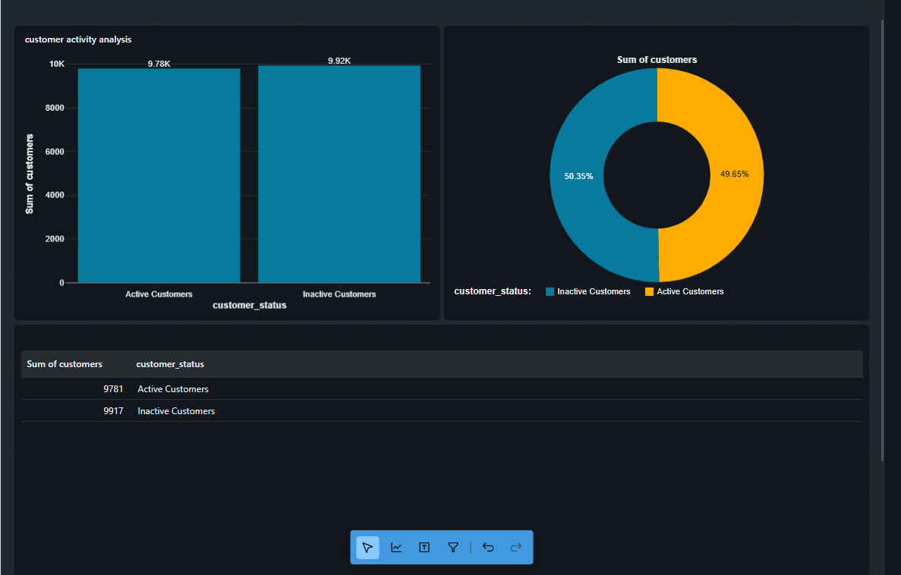
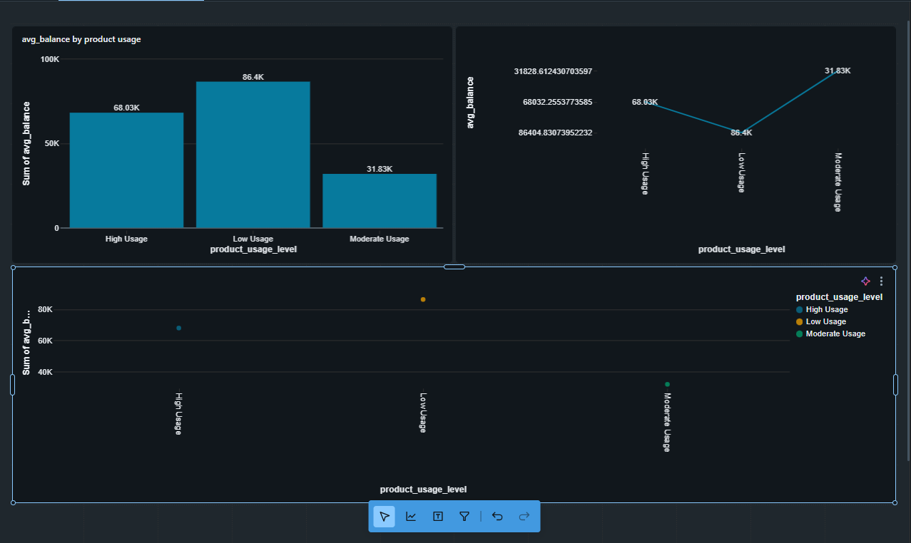
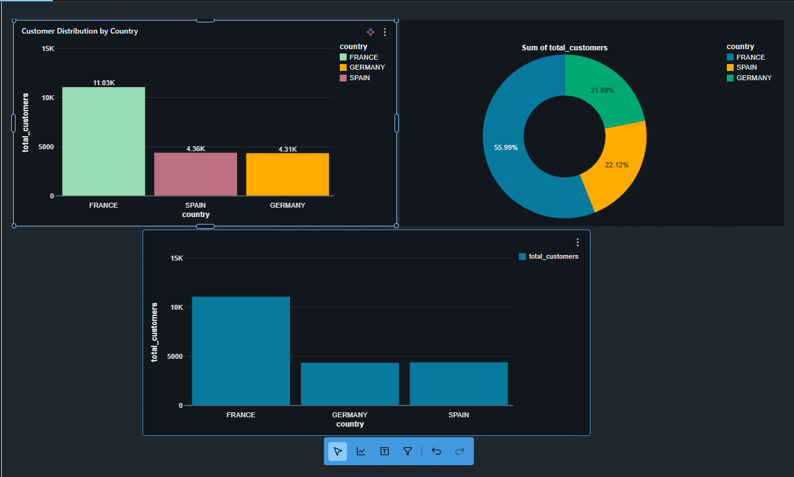

# Bank Customer Churn Data Pipeline (Databricks + AWS)

## Project Overview

This project implements an end-to-end data engineering pipeline for bank customer churn analysis using AWS, Databricks, PySpark, and Delta Lake.

The pipeline ingests raw customer data from AWS S3, processes and enriches it through a structured Medallion Architecture (Bronze → Silver → Gold), and generates analytics-ready feature sets for churn prediction in Unity Catalog.

It incorporates daily batch processing, robust error handling, data quality validation, alerting via Slack, and Git-based version control, ensuring scalability, reliability, and maintainability.

The final output enables:

- Identification of high-risk customers
- Development of ML models for churn prediction
- Data-driven customer retention strategies

## About: Customer Churn Lakehouse Data Mart

This project follows a **Lakehouse** approach (data lake storage + warehouse reliability via Delta Lake) and publishes curated **data mart** tables for analytics and ML.

- **Lakehouse layers**: Bronze (raw) → Silver (cleaned/validated) → Gold (dimensional + features)
- **Data mart outputs**: Gold `dim_*` and `fact_*` tables designed for BI dashboards and churn modeling
- **Governance**: Tables are managed in **Databricks Unity Catalog** for discoverability and access control

## Dataset

### Dataset Source

- **File name**: `Bank_Customer.csv`
- **Source**: Kaggle – Bank Customer Churn Dataset

This dataset simulates a real-world banking environment with customer-level financial and behavioral data.

### Dataset Description

#### Columns included

- `id`
- `CustomerId`
- `Surname`
- `CreditScore`
- `Geography`
- `Gender`
- `Age`
- `Tenure`
- `Balance`
- `NumOfProducts`
- `HasCrCard`
- `IsActiveMember`
- `EstimatedSalary`

#### Key features explanation

- **CreditScore**: Creditworthiness of customer
- **Geography**: Customer location
- **Tenure**: Relationship duration with bank
- **Balance**: Account balance
- **NumOfProducts**: Number of services used
- **IsActiveMember**: Customer activity status

## Project Architecture



This project integrates AWS services with Databricks to build a scalable data pipeline.

### Components used

- **AWS S3**: Raw data storage
- **AWS Glue Crawler & Data Catalog**: Schema inference & metadata
- **Amazon MWAA (Airflow)**: Pipeline orchestration
- **Databricks (Unity Catalog)**: Data processing & governance
- **Delta Lake**: Reliable storage with ACID properties

### Data flow

```text
Kaggle Dataset (Bank_Customer.csv)
            ↓
          AWS S3
            ↓
     AWS Glue Crawler
            ↓
 Bronze Layer (Databricks)
            ↓
 Silver Layer (Databricks)
            ↓
 Gold Layer (Feature Engineering)
            ↓
   Analytics / ML Models
```

### S3 layout (example used in this repo)

- **Raw CSV (sensor input)**: `s3://bank-customer-churn-data/raw/test.csv` (see `Development/Airflow/bank_churn_dag.py`)
- **Processed Parquet (Glue output / Bronze input)**: `s3://bank-customer-churn-data/processed/` (see `Development/Databricks/Bronze_customer_data.py`)



### Glue job (example used in this repo)

- **Glue job name**: `Bank_churn_Parquet_Etl` (see `Development/Airflow/bank_churn_dag.py`)



### Orchestration (MWAA / Airflow)

The Airflow DAG waits for the raw file in S3, triggers the Glue job, and then triggers a Databricks job run:

- **DAG**: `Development/Airflow/bank_churn_dag.py`

## Medallion Architecture

### Bronze Layer

- **Table (in this repo)**: `churn_catalog.raw.customer_data1`



**Operations**

- Ingest processed parquet from S3 (output of Glue job)
- Normalize column names to lowercase
- Simulate malformed values (for validation testing)
- Store in Delta format

### Silver Layer



- **Table (in this repo)**: `churn_catalog.silver.customer_cleaned1`

**Transformations**

- Remove duplicates
- Handle null values
- Standardize data
- Clean inconsistencies

### Gold Layer



#### Dimension tables

- `dim_customer`
- `dim_activity`
- `dim_geography`
- `dim_product`

#### Fact table

- `fact_customer_churn`

#### Features generated

- Customer segmentation
- Activity metrics
- Product usage insights
- Geography-based analysis
- Churn risk indicators

## Delta Lake Features

### Time Travel (Delta history & rollback)

Delta tables support querying older versions (useful for audits and debugging), e.g.:

- `SELECT * FROM churn_catalog.silver.customer_cleaned1 VERSION AS OF 1`
- `DESCRIBE HISTORY churn_catalog.silver.customer_cleaned1`

### Schema Evolution

This repo uses Delta schema evolution options in the ingestion layers:

- **Bronze**: `.option("mergeSchema", "true")` to allow new columns during appends
- **Silver/Gold**: `.option("overwriteSchema", "true")` during overwrite writes

## Data Quality Validation

### Current validations implemented (in PySpark)

Validations are enforced primarily in the Silver layer and covered by pytest checks:

- Null checks (e.g., `customerid` must not be null)
- Duplicate detection (unique `customerid`)
- Range checks (age 18–100, credit score 300–900)
- Type standardization and categorical standardization (uppercasing)


## Error Handling & Alerting (Slack)

### Error handling

- **PySpark jobs**: Each layer uses `try/except/finally` with structured logging for failure visibility.
- **Airflow DAG**: Failures occur at the sensor/Glue/Databricks tasks and are visible in MWAA logs.

### Slack alerts (integration approach)

Typical integration points:

- **Airflow**: `on_failure_callback` at DAG/task level to send Slack alerts (DAG id, task id, run id, log URL)
- **Databricks Jobs**: job failure notifications + webhook forwarding

> Note: Slack webhook secrets should be stored in Airflow Connections/Variables or a secrets manager (never committed).

## PPT & Screenshots (to add)

This repo currently does not include a `docs/` folder. When you’re ready, add:

- A `PPT/` folder for your presentation
- A `Screenshots/` folder for platform screenshots (Glue, S3, MWAA/Airflow, Databricks)

## Pipeline Orchestration

Orchestrated using Amazon MWAA (Apache Airflow).

### Workflow

- **Step 1**: AWS Glue Job (S3 → Processing → S3)
- **Step 2**: Databricks Workflow
  - Bronze Task
  - Silver Task
  - Gold Task

### Scheduling

- Daily batch pipeline
- Automated via Airflow DAG

## Data Quality Checks

Implemented across all layers:

- Null value validation
- Duplicate detection
- Schema validation
- Data type consistency

### Monitoring

- Airflow logs (MWAA)
- Databricks logs
- Slack alerts for failures & anomalies

## Testing

Layer-wise testing ensures correctness and reliability.

### Test files

- `Testing/test_bronze.py`
- `Testing/test_silver.py`
- `Testing/test_gold.py`

### Coverage

- Ingestion validation
- Transformation logic
- Feature engineering correctness

### Run tests locally

```bash
pip install -r requirements-dev.txt
pytest -q
```

## Project Structure

```text
bank-customer-churn-data-pipeline
│
├── assets
│   └── project-architecture.jpeg
│
├── Dashboard
│   └── (Dashboard images)
│
├── Datasets
│   └── Bank_Customer.csv
│
├── Development
│   ├── Airflow
│   │   ├── bank_churn_dag.py
│   │   └── requirements.txt
│   └── Databricks
│       ├── Bronze_customer_data.py
│       ├── Silver_customer_Profiles.py
│       └── gold_customer_profiles.py
│
├── Testing
│   ├── test_bronze.py
│   ├── test_silver.py
│   └── test_gold.py
│
├── docs
│   ├── ppt
│   ├── screenshots
│   └── test-results
│
└── README.md
```

## Pipeline Execution Flow

```text
Airflow DAG
     ↓
AWS Glue Job
     ↓
Databricks Bronze Task
     ↓
Databricks Silver Task
     ↓
Databricks Gold Task
```

## Technologies Used

- Python
- PySpark
- Databricks
- Delta Lake
- AWS S3
- AWS Glue
- Amazon MWAA (Airflow)
- Unity Catalog
- boto3
- pytest
- Slack (Alerting)
- Git & GitHub

## Business Insights & Dashboards

The repository includes dashboard snapshots illustrating customer behavior and churn-related segmentation.

### Dashboard images






## Business Impact

- Enables churn prediction readiness
- Identifies high-risk customers
- Supports targeted retention strategies
- Improves data-driven decision making

## Future Enhancements

- Real-time streaming pipeline
- ML model integration for churn prediction
- Advanced dashboards and BI integration
- Automated data quality monitoring
